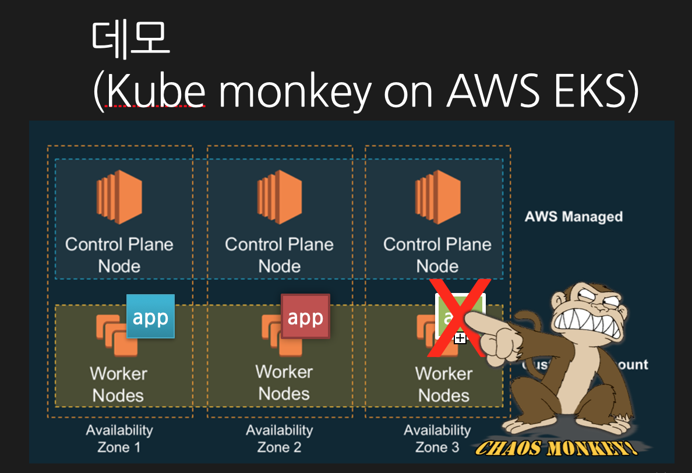

# eks-kube-monkey
Running kube monkey on AWS EKS.


## Pre-requisition
**1**. Setup EKS
  - configure eks kubeconfig file
  ```bash
  $ aws eks describe-cluster --name devel  --query cluster.endpoint
  $ aws eks describe-cluster --name devel  --query cluster.certificateAuthority.data
  ```
  - deploy worker nodes
  using Cloudformation(https://docs.aws.amazon.com/eks/latest/userguide/launch-workers.html)
  ```
  https://docs.aws.amazon.com/eks/latest/userguide/launch-workers.html
  ```
  - configure aws-auth-cm file (update ARN which provided from Cloudformation)
  ```
  rolearn: <ARN of instance role (not instance profile)>
  ```
  
**2**. Deploy Guestbook container (refer to Jeff bar's blog https://aws.amazon.com/ko/blogs/aws/amazon-eks-now-generally-available/)

## Demo
**3**. Deploy Kube-monkey(https://github.com/asobti/kube-monkey.git).

**4**. Update application deployments tags for Kube-monkey.

**5**. Find out the Kube-monkey logs(schedule for making chaos).

**6**. Check the victim application pods with K8S logs.

**7**. Figure out service level of an outage.